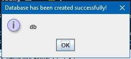
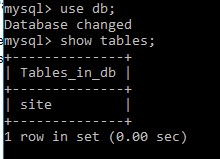
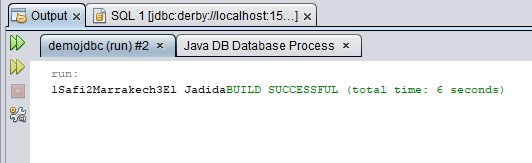

# TP Java DataBase Connectivity : JDBC

Solutions des Exercices TP1-5:

- `demojdbc` ou `Insertion et récupération des données`: TP1.
- `ExoJDBC` ou `Scripts des developpeurs`: TP2.
- `messagerie` ou `systemeMessagerie`: TP3.
- `entreprise` ou `Gestion des employes`: TP4
- `GestionEmploye` ou `Java/Swing/JDBC/MySQL`: TP4

## Execution de TP1:

### 1: Creation de database db:

### 1: Creation de table site:

### 1: Insertion des donnees:

"# TP-JDBC-PreparedStatement" 
